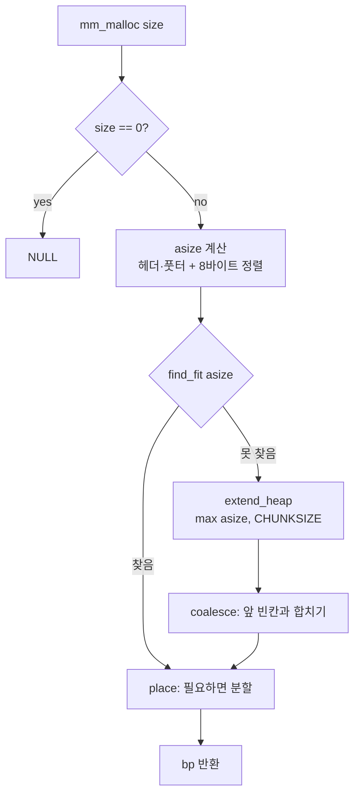
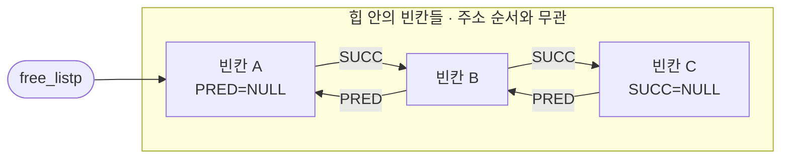

# 6주차 WIL — Malloc Lab

> [!abstract] 한 줄 요약
> implicit free list로 시작해서 **first fit → next fit → explicit free list** 순서로 바꿨고, 점수는 **53 → 76~82점**이 됐다.
> 마지막 실험으로 "더 똑똑한 찾기 방식이 늘 이기는 것은 아니다"를 확인했다.

> [!info] 기본 정보
> - 기간: 2026.10.01 ~ 10.08 (구현 기록 10.06 ~ 10.08)
> - 주제: CS:APP 9장 동적 메모리 할당, Malloc Lab
> - 환경: C, `-m32`, `WSIZE` 4바이트, 8바이트 정렬
> - 파일: `mm.c` (implicit + next fit), `mm-explicit.c` (explicit + first fit)
> - 상세 기록: `LOG.md`, `ATTEMPTS.md`

## 목차
- [[#1. 개념 정리]]
- [[#2. 구현 과정]]
- [[#3. 결과]]
- [[#4. 막혔던 점과 어려웠던 점]]
- [[#5. 회고 (KPT)]]

## 점수 변화

| 단계 | Perf index | 비고 |
| --- | --- | --- |
| implicit + first fit | 53 | 첫 11/11 통과 |
| implicit + next fit | 74 ~ 78 | thru 8 → 30~34 |
| **explicit(LIFO) + first fit** | **76 ~ 82** | 최종 |
| explicit + best fit | 63 | 실험 |
| explicit + next fit | 59 ~ 61 | 실험 |

---

## 1. 개념 정리

### 1-1. 동적 메모리 할당기 #concept

- `malloc`/`free` 요청을 처리하는 프로그램. 관리 대상은 **힙(heap)**.
- 힙은 가상 주소 공간에서 데이터 영역 위에 있고 높은 주소 쪽으로 자란다. 끝은 커널의 `brk` 포인터.
- 힙을 늘리는 시스템 콜 `sbrk` → Malloc Lab에서는 `memlib.c`의 `mem_sbrk`가 흉내 낸다.
- 한 번에 `CHUNKSIZE`(4KB)씩 늘린다. 커널에 매번 부탁하면 느리기 때문.

> [!tip] 두 목표는 서로 부딪친다
> - **처리량(throughput)**: 초당 처리 요청 수 → mdriver `Kops`
> - **이용도(utilization)**: 힙 중 실제로 쓰는 비율 → mdriver `util`
>
> `Perf index = 60 × util + 40 × min(1, 처리량 / 기준)`
> util이 60점, thru가 40점 만점. 평균 util이 4%p 올라도 점수는 약 2~3점.

> [!note]- 배경: 가상 메모리와 힙
> - 프로세스마다 자기만의 가상 주소 공간이 있고, 물리 메모리와는 페이지 단위로 연결된다(페이지 테이블).
> - `sbrk`로 힙을 늘리는 것은 가상 주소 범위를 넓히는 것. 실제 물리 페이지는 처음 접근할 때 페이지 폴트를 거쳐 연결된다.
> - `malloc`은 받아 온 큰 덩어리를 잘게 쪼개 나눠 주는 역할이다.

### 1-2. 단편화 #concept

| 종류 | 뜻 | 이번 코드에서 |
| --- | --- | --- |
| 내부 단편화 | 블록 안에서 낭비 | 헤더·풋터 8바이트, 정렬 패딩, 최소 블록 16바이트 |
| 외부 단편화 | 빈 공간 합은 충분한데 붙어 있지 않음 | `binary` 트레이스: 빈칸 사이에 사용 중인 칸이 끼어 합쳐지지 못함 |

> [!important]
> `binary`, `binary2`의 util은 어떤 찾기 방식을 써도 **55%, 51%** 그대로였다. 외부 단편화는 "어느 칸을 고르느냐"로 해결되지 않는다.

### 1-3. 블록 구조와 경계 태그 #concept

```
bp-4      bp                             bp+size-8
|         |                              |
v         v                              v
+---------+------------------------------+---------+
| header  | payload (+ padding)          | footer  |
| size|a  |                              | size|a  |
+---------+------------------------------+---------+
```

- **헤더** = 크기 + 할당 비트. 크기가 8의 배수라 아래 3비트가 늘 0 → 그 자리에 할당 여부.
    - `GET_SIZE` = `& ~0x7`, `GET_ALLOC` = `& 0x1`
- **풋터** = 헤더 복사본. **경계 태그(boundary tag)**. 앞 블록 크기를 바로 알 수 있어서 앞 칸과 합치기가 상수 시간.
- `bp`는 헤더가 아니라 **payload 시작**. 사용자에게 돌려주는 주소.

| 매크로 | 하는 일 |
| --- | --- |
| `PACK(size, alloc)` | 크기 + 할당 비트 합치기 |
| `GET(p)` / `PUT(p, val)` | 한 워드 읽기 / 쓰기 |
| `HDRP(bp)` / `FTRP(bp)` | 헤더 / 풋터 위치 |
| `NEXT_BLKP(bp)` / `PREV_BLKP(bp)` | 메모리상 다음 / 이전 블록 |

### 1-4. 프롤로그와 에필로그 #concept

```
+---------+-----------+-----------+-----------+
| pad 0   | 8/1 hdr   | 8/1 ftr   | 0/1 hdr   |
+---------+-----------+-----------+-----------+
  padding |<------ prologue ----->| epilogue
                      ^
                      heap_listp
```

- 힙 양 끝에 "항상 할당된 가짜 블록"을 세워 두면 coalesce에서 경계 처리가 필요 없다.
- 에필로그 크기가 0 → 순회 조건 `GET_SIZE(HDRP(bp)) > 0`.

### 1-5. 요청 크기 맞추기 (asize) #concept

```c
if (size <= DSIZE)
    asize = 2*DSIZE;                                         /* 최소 16바이트 */
else
    asize = DSIZE * ((size + (DSIZE) + (DSIZE-1)) / DSIZE);  /* 헤더+풋터 8 더하고 8의 배수로 올림 */
```

### 1-6. 빈 블록 찾기 정책 #concept

| 정책 | 방법 | 장점 | 단점 |
| --- | --- | --- | --- |
| first fit | 처음부터, 맞는 첫 칸 | 단순 | 앞쪽에 조각이 쌓여 느려짐 |
| next fit | 지난번 멈춘 자리부터 | 빠름 | 조각이 퍼져 util 하락 |
| best fit | 끝까지 보고 가장 딱 맞는 칸 | util 최고 | 매번 끝까지 → 느림 |

### 1-7. 분할과 연결 #concept

- **분할(place)**: 남는 부분이 최소 블록(16바이트) 이상이면 둘로 나눈다.
- **연결(coalesce)**: 반납 즉시 앞뒤 빈칸과 합친다(immediate coalescing).

| Case | 앞 | 뒤 | 결과 |
| --- | --- | --- | --- |
| 1 | 할당 | 할당 | 그대로 |
| 2 | 할당 | **빈칸** | 나 + 뒤 |
| 3 | **빈칸** | 할당 | 앞 + 나 (bp → 앞 칸) |
| 4 | **빈칸** | **빈칸** | 앞 + 나 + 뒤 (bp → 앞 칸) |



### 1-8. 빈 블록 관리 방법 #concept

| 방법 | 구조 | 찾는 시간 |
| --- | --- | --- |
| implicit | 모든 블록을 크기로 건너가며 순회 | 전체 블록 수 |
| **explicit** | 빈칸끼리 이중 연결 리스트 | 빈칸 수 |
| segregated | 크기별 리스트 여러 개 | 해당 크기 리스트만 |

explicit 빈칸 모양:

```
+--------+-----------+-----------+-------+--------+
| header | PRED      | SUCC      |  ...  | footer |
| size|0 | prev free | next free |       | size|0 |
+--------+-----------+-----------+-------+--------+
         ^           ^
         bp          bp+4
```



- payload 자리를 재활용하므로 추가 메모리가 없다.
- 32비트: `헤더 4 + PRED 4 + SUCC 4 + 풋터 4 = 16` → 최소 블록이 implicit과 같다. 64비트는 포인터가 8바이트라 더 커진다.
- 넣는 위치: **LIFO**(맨 앞, O(1), 이번 구현) vs **주소 순서**(정렬 삽입, util 유리).

### 1-9. realloc #concept

- naive: `malloc` → `memcpy` → `free`.
- 이번 주 가장 큰 병목. 전체 0.222초 중 **0.200초**를 realloc 트레이스가 쓴다.
- 개선 방향: 뒤 칸이 비었거나 힙 끝이면 **제자리에서 늘리기**.

### 1-10. C 개념 #c-language

| 개념 | 정리 |
| --- | --- |
| 포인터 연산 단위 | `(char *)`로 바꿔야 바이트 단위로 움직인다 |
| 위치 vs 크기 | 주소는 주소끼리, 크기는 크기끼리 비교 |
| 매크로는 쓰일 때 컴파일 | 틀린 매크로도 정의만 하면 에러가 안 난다 |
| 매크로 결과는 상자가 아님 | `NEXT_BLKP(bp) = NULL;` → `lvalue required` |
| 함수 호출 모양 | `remove_free;`는 이름만 적은 것. `remove_free(bp);` |
| 변수 vs 함수 | 변수에 괄호 X. 함수 이름 = 함수 코드의 주소 |
| `for (시작; 조건; 이동)` | 세 칸 필수 |
| `statement with no effect` | 계산만 하고 결과를 버리는 줄 |
| 경고 없음 ≠ 정답 | 조건 방향이 틀려도 컴파일은 된다 |

---

## 2. 구현 과정

### 타임라인

| 날짜 | 이슈 | 한 일 | 커밋 |
| --- | --- | --- | --- |
| 10.06 | #14~#19 | 매크로, `mm_init`, `extend_heap`, `mm_free`, `coalesce`, `mm_malloc` | `464e06e` |
| 10.07 | #20 #23 | `find_fit`(first fit), `place` → 9/11 통과 | `e2f9afe` |
| 10.07 | #24 | `mm_realloc` 수정 → 11/11, **53점** | `018989f` |
| 10.07 | #21 | next fit → **74~78점** | `9d07c80` |
| 10.07 | #22 | 명시적 리스트 `mm-explicit.c` → **76~82점** | `368ae61` |
| 10.08 | #22 | best fit / next fit 비교 실험 | `373389f` |

> [!note] 작업 방식
> - 함수 단위로 GitHub 이슈(#14~#24)를 만들고, 하나 끝날 때마다 `[#이슈번호] 한 일` 형식으로 커밋.
> - 코드는 직접 작성. Claude는 "확인해 줘"로 `make`와 `./mdriver -V` 결과 해석만. 막히면 완성 코드 대신 원인 위치와 힌트.
> - 커밋마다 `LOG.md`(요약)와 `ATTEMPTS.md`(시도별 코드와 실패 원인) 기록.

### 2-1. implicit 기본 함수 (#14~#19)
매크로 → `mm_init` → `extend_heap` → `mm_free` → `coalesce` → `mm_malloc`.
`place`가 없어서 `undefined reference to 'place'` 링크 에러로 실행 불가.

### 2-2. first fit, place (#20, #23)

```c
for (bp = heap_listp; GET_SIZE(HDRP(bp)) > 0; bp = NEXT_BLKP(bp)) {
    if (!GET_ALLOC(HDRP(bp)) && GET_SIZE(HDRP(bp)) >= asize) {
        return bp;
    }
}
return NULL;
```

> [!bug] 처음 실수
> 크기만 비교해서 **이미 할당된 칸도** 골랐다 → `!GET_ALLOC(...)` 추가.

첫 실행 9/11 통과. `realloc`, `realloc2` → `mm_realloc did not preserve the data from old block`.

### 2-3. mm_realloc (#24)

naive 코드는 크기를 `SIZE_T_SIZE`(8바이트) 앞에서 읽었다. 우리 블록의 크기는 **4바이트 앞 헤더**에 있고, 8바이트 앞은 **앞 블록의 풋터**다.

```c
copySize = GET_SIZE(HDRP(ptr));   /* 헤더에서 블록 크기 */
copySize = copySize - DSIZE;      /* 헤더+풋터를 뺀 payload 크기 */
```

> [!example]- 다섯 번의 시도 펼치기
> 1. `oldptr - DSIZE` → "몇 바이트 앞을 읽을지"를 "뺄 값"으로 착각
> 2. `(char *)WSIZE - SIZE_T_SIZE` + `copySize-DSIZE;` → 주소가 사라져 segmentation fault, 결과를 버리는 줄
> 3. `SIZE_T_SIZE(HDRP)` → 숫자에 괄호, 매크로에 인자 없음
> 4. `oldptr - GET_SIZE(HDRP(bp))` → 괄호 안 닫힘, 이 함수엔 `bp`가 없음
> 5. `GET_SIZE(HDRP(ptr))` → **성공, 53점**

### 2-4. next fit (#21)

지난번 멈춘 자리 `find_heap`부터 찾기.

> [!warning] 해결해야 했던 두 문제
> - **문제 A** — 멈춘 자리부터 끝까지만 찾고 포기 → `Ran out of memory`
>   → 처음부터 `find_heap` 직전까지 두 번째 for 문 (`bp < find_heap`)
> - **문제 B** — coalesce로 합쳐지면 `find_heap`이 큰 칸의 **한가운데**를 가리킴 → `Payload overlaps another payload`
>   → 합친 칸 안쪽이면 칸의 시작으로 옮기기

```c
/* coalesce 끝 */
if (find_heap > (char *)bp && find_heap < NEXT_BLKP(bp)) {
    find_heap = bp;
}
```

결과: thru 8 → 30~34, **74~78점**. binary 10~25배 빨라짐. util 74% → 73%.

### 2-5. 명시적 가용 리스트 (#22)

`mm.c`는 그대로 두고 `mm-explicit.c`에 구현.

| 추가/수정 | 내용 |
| --- | --- |
| `PRED`, `SUCC` | 빈칸 안 앞/뒤 주소 자리 (`bp`, `bp + 4`) |
| `free_listp` | 줄의 맨 앞, 처음 `NULL` |
| `insert_free` | 맨 앞에 넣기 (LIFO) |
| `remove_free` | 앞 칸과 뒤 칸을 서로 이어 주며 빼기 |
| `coalesce` | 합칠 이웃은 빼고, 합친 결과는 넣기 |
| `place` | 할당 칸은 빼고, 남은 조각은 넣기 |
| `find_fit` | 줄의 뒤 칸으로 이동 |

| 방식 | 시작 | 조건 | 이동 |
| --- | --- | --- | --- |
| first fit | `heap_listp` | 크기 ≠ 0 | `NEXT_BLKP(bp)` |
| next fit | `find_heap` | 크기 ≠ 0 | `NEXT_BLKP(bp)` |
| explicit | `free_listp` | `bp != NULL` | `(char *)GET(SUCC(bp))` |

결과: **76~82점**. coalescing을 뺀 0~8번이 next fit보다 약 3~12배 빨라짐.

> [!quote] 직접 쓴 것과 안내받은 것
> | 부분 | 누가 |
> | --- | --- |
> | 설계(자리, 최소 크기, 넣고 빼는 곳) | 질문에 답하며 정리 |
> | `PRED`, `SUCC` | 두 번 시도 후 안내받음 |
> | `free_listp` | 직접 |
> | `insert_free` | 안내받음 |
> | `remove_free` | 네 번 시도 후 안내받음 |
> | `place`, `coalesce` 호출 8줄 | 직접 (위치는 처음부터 맞음, 문법 세 번 수정) |
> | `find_fit` for 문 | 두 번 시도 후 한 줄 안내받음 |
> | best fit / next fit 실험 코드 | Claude 작성 |

### 2-6. 비교 실험 (10.08)

| explicit + | util | thru | Perf |
| --- | --- | --- | --- |
| **first fit** | 42 | 29~40 | **71~82** |
| best fit | 45 | 18 | 63 |
| next fit | 43 | 16~18 | 59~61 |

> [!question] best fit은 왜 졌나?
> util +4%p = 점수 +3점. 대신 binary에서 합쳐지지 못한 빈칸 수천 개를 요청마다 끝까지 훑어 thru −16~22점. 정작 binary util은 그대로.

> [!question] next fit은 왜 졌나?
> LIFO에서는 쪼개고 남은 조각이 줄 **맨 앞**에 들어간다. 기억한 자리는 이미 줄 중간이라 쓸 만한 칸이 늘 등 뒤에 있다 → 거의 한 바퀴를 돈다.
> LIFO + first fit은 이미 "가장 최근 빈칸부터 보기"를 하고 있다.

> [!success] 결론
> 찾기 방식의 좋고 나쁨은 **리스트를 어떤 순서로 세우느냐**에 따라 달라진다. best fit이 손해 없이 쓰이려면 찾을 범위를 좁혀야 한다 → segregated list.

---

## 3. 결과

| 번호 | 트레이스 | first fit | next fit | explicit |
| --- | --- | --- | --- | --- |
| 0 | amptjp | 99% / 450 | 91% / 2407 | 89% / 19139 |
| 1 | cccp | 99% / 731 | 92% / 3344 | 92% / 30666 |
| 2 | cp-decl | 99% / 445 | 95% / 1560 | 94% / 15844 |
| 3 | expr | 100% / 535 | 97% / 924 | 96% / 11384 |
| 4 | coalescing | 66% / 123818 | 66% / 113654 | 66% / 75235 |
| 5 | random | 92% / 428 | 91% / 791 | 88% / 4262 |
| 6 | random2 | 92% / 452 | 89% / 890 | 85% / 6286 |
| 7 | binary | 55% / 44 | 55% / 480 | 55% / 1759 |
| 8 | binary2 | 51% / 57 | 51% / 1441 | 51% / 3800 |
| 9 | realloc | 27% / 106 | 27% / 98 | 26% / 72 |
| 10 | realloc2 | 34% / 4217 | 45% / 3555 | 34% / 2875 |
| 합계 | | 74% / 125 | 73% / 513 | 71% / 506 |
| **점수** | | **53** | **74~78** | **76~82** |

(표 값: util / Kops)

> [!summary] 결과에서 읽은 것
> 1. 찾기 속도는 해결됐고 **병목은 realloc**. 9번 트레이스가 전체 시간의 약 90%.
> 2. 방식을 바꿀수록 util이 조금씩 떨어졌다. next fit, LIFO 모두 주소 순서와 무관하게 골라서 조각이 퍼진다.
> 3. binary의 util은 찾기 방식으로 못 고친다(외부 단편화).
> 4. Kops는 실행마다 흔들린다 → 여러 번 돌려서 비교.

---

## 4. 막혔던 점과 어려웠던 점

### 4-1. 포인터: 위치 / 크기 / 값 구분 #어려움

> [!failure] 가장 많이 막힌 곳
> 이번 주 실수의 대부분이 여기서 나왔다.

| 막힌 곳 | 헷갈린 것 | 깨달은 것 |
| --- | --- | --- |
| realloc `oldptr - SIZE_T_SIZE` | 읽을 위치와 뺄 값을 같은 숫자로 | 읽기와 빼기는 다른 단계. 8바이트 앞은 앞 블록 풋터 |
| realloc `oldptr` 자리에 `WSIZE` | 주소 대신 숫자 → segfault | 주소가 빠지면 어느 블록인지 사라진다 |
| `GET_SIZE(HDRP(bp)) < find_heap` | 크기(수천)와 주소(수십억) 비교 → 항상 참 → 에필로그에서 무한 반복 | 위치는 위치와: `bp < find_heap` |
| `pred(bp)` 매크로 | 크기만큼 건너뛰는 모양을 따라 함 | 그건 옆 칸 계산. 필요한 건 고정 자리 `bp`, `bp+4` |
| `HDRP(bp)`를 빼고 더함 | 위치를 거리처럼 | 위치 − 위치 = 거리, 위치 + 위치 = 의미 없음 |
| `SUCC(bp)`와 그 안의 값 | 자리와 값 혼동 | 자리 `SUCC(bp)` / 읽기 `(char *)GET(SUCC(bp))` / 쓰기 `PUT(SUCC(bp), 값)` |

### 4-2. 조건식의 방향 #어려움

> [!example]- coalesce의 find_heap 조건, 네 번의 시도
> 1. `find_heap < bp && > NEXT_BLKP(bp)` → `&&` 뒤 왼쪽 누락, 컴파일 에러
> 2. `find_heap < !GET_ALLOC(HDRP(bp)) && ...` → 0/1과 주소 비교, 항상 거짓
> 3. `find_heap < (char *)bp && find_heap > NEXT_BLKP(bp)` → **경고 없이 컴파일, 결과는 그대로**
> 4. `find_heap > (char *)bp && find_heap < NEXT_BLKP(bp)` → 성공

> [!danger] 3번이 가장 무서웠다
> 에러도 경고도 없는데 if 안이 한 번도 실행되지 않았다. "bp보다 앞이면서 다음 칸보다 뒤"인 위치는 존재하지 않는다.

> [!tip] 해결법: 숫자를 넣어 본다
> `bp = 100`, `find_heap = 150`, 다음 칸 `= 200` → 150은 100보다 크고 200보다 작아야 한다.

### 4-3. 명시적 리스트: 넣기와 빼기를 같이 맞추기 #어려움

- `place`만 고치고 실행 → segfault. coalesce가 아직 줄에 안 넣으니, 줄에 없는 칸을 빼려다 죽음. **넣기 3곳 + 빼기 5곳이 다 맞아야 동작.**
- `place`에서 `remove_free(bp)`를 `bp = NEXT_BLKP(bp);` 뒤에 두면 남은 조각을 뺀다 → **함수 맨 위**에서 뺀다.
- coalesce의 `NEXT_BLKP`/`PREV_BLKP`는 지우지 않는다. 합치기는 메모리상 붙은 칸끼리. `PRED`/`SUCC`는 찾기용.

> [!todo] 다시 해 볼 것
> `insert_free`, `remove_free`는 안내받은 코드다. "앞 칸의 뒤"와 "뒤 칸의 앞"을 동시에 고치는 그림이 머릿속에 안 그려졌다. 종이에 칸을 그려 가며 빈 파일에서 다시 직접 써 보기.

### 4-4. C 문법 실수 모음 #c-language

| 실수 | 에러/경고 | 고친 방법 |
| --- | --- | --- |
| 함수 본체 첫 줄 세미콜론 | 컴파일 에러 | 세미콜론은 원형에만 |
| 원형 누락 | `implicit declaration` | 사용 위치보다 위에 원형 |
| 전역 변수 누락 | `heap_listp undeclared` | `static char *heap_listp;` |
| `copySize-DSIZE;` | `statement with no effect` | `copySize = copySize - DSIZE;` |
| `find_heap(bp)` | `called object is not a function` | 변수에 괄호 X |
| `bp = find_fit` | `incompatible pointer type` | 함수 이름 = 함수 코드 주소 |
| `PUT(find_heap, 0)` | - | 변수에는 `=` |
| for 문 가운데 칸 삭제 | `expected ';' before ')'` | 세 칸 필수 |
| `remove_free;` | `statement with no effect` | `remove_free(bp);` |
| `remove_free;(PREV_BLKP(bp))` | `expected ';'` | 세미콜론은 괄호 뒤 |
| `NEXT_BLKP(bp) = NULL;` | `lvalue required` | 매크로 결과는 상자 X |
| `if (조건1; 조건2)` | 컴파일 에러 | `&&` |
| `GET_SIZE`로 주소 읽기 | - | 주소는 `GET` |

### 4-5. 작업 습관 #습관

> [!warning] 저장 안 하고 make
> "고쳤는데 결과가 그대로"가 두 번. make 전에 Ctrl+S, 이상하면 저장 시각부터 확인.

> [!warning] 매크로는 써야 검사된다
> 틀린 `pred`, `sicc`를 정의만 했을 때 11/11 통과 → 맞는 줄 알았다.

> [!warning] 통과 ≠ 정답
> next fit 중간에 일부 트레이스가 통과했지만 문제 B가 우연히 안 드러났을 뿐이었다.

---

## 5. 회고 (KPT)

> [!check] Keep
> - 함수 단위 이슈 + 커밋 + 기록 → 날짜별로 되짚을 수 있었다.
> - 실패한 시도를 `ATTEMPTS.md`에 남김 → 반복되는 실수가 눈에 보였다.
> - 힌트로 직접 고치기 → next fit과 coalesce 조건은 끝까지 내 손으로.
> - "best fit이 더 좋지 않나?"를 측정으로 확인.

> [!failure] Problem
> - 포인터에서 위치 / 크기 / 값을 계속 섞어 썼다.
> - `insert_free`, `remove_free`, `find_fit` for 문 한 줄은 안내받았다.
> - `mm_realloc`은 크기 읽는 부분만 고쳐서 가장 큰 병목이 그대로다.
> - 숫자를 넣어 확인하는 습관 부족(조건 방향 네 번 시도).

### Try
- [ ] 포인터 코드를 쓰기 전에 종이에 칸을 그리고 주소 숫자를 넣어 보기
- [ ] `insert_free`, `remove_free`를 빈 파일에서 다시 직접 써 보기
- [ ] `mm_realloc`: 뒤 칸이 비었거나 힙 끝이면 제자리에서 늘리기
- [ ] `mm_realloc`: `ptr == NULL`, `size == 0` 처리
- [ ] segregated free list로 util과 thru 같이 올리기

---

## 참고
- CS:APP 9장 가상 메모리, 9.9 동적 메모리 할당
- 저장소 `kal-moon/jungle_week6` — `mm.c`, `mm-explicit.c`, `LOG.md`, `ATTEMPTS.md`

## 관련 노트
- [[Malloc Lab]]
- [[CSAPP 9장 가상 메모리]]
- [[C 포인터]]
